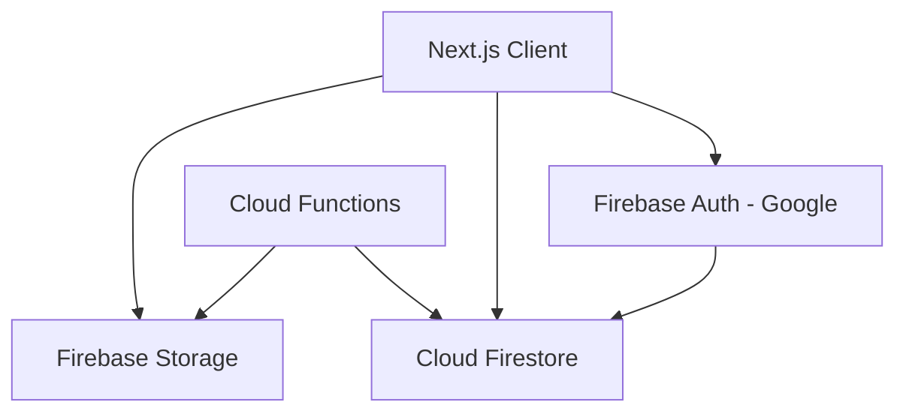

# Architecture — Future Pets

System design for the Next.js frontend and Firebase backend.

---

## High-level overview



| Component | Responsibility |
|-----------|----------------|
| Next.js App Router | UI, routing, client-side Firebase SDK |
| Firebase Auth | Google Sign-In, session tokens |
| Cloud Firestore | Users, pets, inventory, trades, sessions |
| Firebase Storage | Pet avatars, cosmetic assets |
| Cloud Functions | Stat rolls, trade settlement, breeding, anti-cheat |
| Firebase Hosting / App Hosting | Production deployment |

---

## Frontend architecture

### Directory conventions

```
src/
├── app/                    # Routes (App Router)
├── components/ui/          # shadcn/ui primitives
├── features/
│   ├── auth/               # Sign-in, auth context
│   ├── onboarding/         # Species + choice flow
│   ├── pets/               # Pet types, hooks, components
│   └── dashboard/          # Pet dashboard UI
└── lib/
    ├── constants/game.ts   # Balance constants
    └── firebase/           # Firebase init (Phase 1+)
        ├── client.ts
        └── config.ts
```

### State management

- **Phase 1–2:** React Context for auth + active pet
- **Phase 3+:** Consider Zustand if cross-feature state becomes unwieldy
- Firestore real-time listeners for pet stats on dashboard

### Server vs client

| Operation | Where |
|-----------|-------|
| Google Sign-In | Client (Firebase Auth SDK) |
| Read own pet data | Client (Firestore SDK + rules) |
| Create pet / roll stats | **Cloud Function** (never client) |
| Trade settlement | **Cloud Function** |
| Breeding / hatch | **Cloud Function** |
| Mini-game reward claim | **Cloud Function** validates score |
| Public profile read | Client (Firestore rules allow public read) |

---

## Firestore schema (v0)

### `users/{uid}`

```typescript
{
  displayName: string;
  email: string;
  username: string;           // unique, for /u/[username] URLs — Phase 3
  photoURL?: string;
  credits: number;
  onboardingComplete: boolean;
  createdAt: Timestamp;
  lastLoginAt: Timestamp;
}
```

### `users/{uid}/pets/{petId}`

```typescript
{
  speciesId: string;          // e.g. "emberfox"
  name: string;
  rarity: "common" | "uncommon" | "rare" | "shiny" | "super";
  imageUrl: string;           // Storage URL or placeholder path
  stats: {
    hunger: number;
    happiness: number;
    health: number;
    energy: number;
    strength: number;
    speed: number;
    defense: number;
    intelligence: number;
  };
  level: number;
  xp: number;                 // progress toward next level
  totalXp: number;            // lifetime XP earned
  levelCostMultiplier: number; // per-pet level cost (lower = faster)
  growthTier?: "normal" | "fast"; // fast = rare shiny/super sub-roll
  createdAt: Timestamp;
  lastCareAt: Timestamp;
  lastDecayAppliedAt: Timestamp;
  isPublic: boolean;          // default true for visit profiles
}
```

### `species/{speciesId}` (static catalog)

Seeded from `STARTER_SPECIES` in `game.ts` + future species. Read-only for clients.

### `items/{itemId}` (Phase 3+)

```typescript
{
  name: string;
  type: "cosmetic" | "consumable" | "tradable";
  creditsPrice: number;
  imageUrl: string;
  statEffects?: Record<string, number>;
}
```

### `users/{uid}/inventory/{itemId}`

```typescript
{
  itemId: string;
  quantity: number;
  acquiredAt: Timestamp;
}
```

### `trades/{tradeId}` (Phase 5)

```typescript
{
  fromUid: string;
  toUid: string;
  status: "pending" | "accepted" | "cancelled" | "completed";
  offeredItems: Array<{ itemId: string; quantity: number }>;
  requestedItems: Array<{ itemId: string; quantity: number }>;
  offeredCredits: number;
  requestedCredits: number;
  createdAt: Timestamp;
  expiresAt: Timestamp;
}
```

### `breedingPairs/{pairId}` (Phase 6)

```typescript
{
  petAId: string;
  petBId: string;
  ownerAUid: string;
  ownerBUid: string;
  status: "pending" | "incubating" | "hatched" | "cancelled";
  eggId: string;
  hatchAt: Timestamp;
  createdAt: Timestamp;
}
```

### `miniGameSessions/{sessionId}` (Phase 4)

```typescript
{
  uid: string;
  gameId: string;
  score: number;
  startedAt: Timestamp;
  completedAt: Timestamp;
  rewardClaimed: boolean;
}
```

### Usernames index (Phase 3)

`usernames/{username}` → `{ uid: string }` for unique username enforcement.

---

## Security rules (principles)

Full rules evolve per phase. Start from stubs in `firestore.rules` (deny all) and open incrementally.

### Phase 1 rules (target)

```
users/{uid}: read/write if request.auth.uid == uid
users/{uid}/pets/{petId}: read/write if request.auth.uid == uid
species/{id}: read if true; write if false
```

### Phase 3 additions

```
users/{uid}: public read if resource.data.isPublicProfile == true (subset of fields)
usernames/{name}: read if true; create if auth + unique
```

### Server-only writes

These collections/functions must **deny client writes**:

- Pet creation rolls (use Callable Function `createStarterPet`)
- Trade status transitions
- Breeding pair creation and hatch
- Mini-game reward claims
- Credits balance adjustments (except validated shop purchases via Function)

---

## Firebase Storage paths

| Path | Purpose |
|------|---------|
| `pets/{uid}/{petId}/avatar.png` | Pet avatar (uploaded or generated) |
| `cosmetics/{itemId}.png` | Shop cosmetic assets |
| `users/{uid}/profile.png` | Profile avatar override |

Storage rules (Phase 1+):

- Users read/write only their own `pets/{uid}/**`
- Cosmetics: public read, admin write

Until Storage is wired, use `public/pets/placeholders/` for static assets.

---

## Cloud Functions (planned)

| Function | Trigger | Purpose |
|----------|---------|---------|
| `createStarterPet` | Callable | Roll stats, write pet doc |
| `applyStatDecay` | Scheduled (hourly) | Batch decay for inactive pets |
| `claimMiniGameReward` | Callable | Validate session, grant XP/credits |
| `executeTrade` | Callable | Escrow + swap |
| `hatchEgg` | Scheduled / Callable | Create offspring pet |

Requires Firebase Blaze plan (billing enabled).

---

## Deployment

### Local development

```bash
npm run dev   # http://localhost:3000
```

### Production options

| Option | Best for |
|--------|----------|
| **Firebase App Hosting** | Full Next.js App Router with SSR (recommended for production) |
| **Static export + Firebase Hosting** | Phase 0-style static pages; limited SSR |
| **Firebase Hosting + Cloud Functions** | Custom server logic |

Current `firebase.json` targets static export (`out/`). Before production deploy:

1. Either configure `output: 'export'` in `next.config.ts` for classic Hosting, or
2. Migrate to Firebase App Hosting for SSR (recommended once auth and dynamic routes land).

Document chosen approach in README when Phase 1 deploys.

### Environment variables

All Firebase client config uses `NEXT_PUBLIC_*` vars from `.env.local`. See `.env.example`.

---

## Decay implementation note

Hybrid care requires applying decay when a pet is loaded:

1. Read `lastDecayAppliedAt`
2. Compute hours elapsed
3. Apply `DECAY_PER_HOUR` per need stat
4. Write updated stats + timestamp

Phase 2: client applies on dashboard load. Phase 3+: scheduled Cloud Function for offline accuracy.

---

## Related documents

- [GAME_DESIGN.md](GAME_DESIGN.md) — mechanics and balance
- [FIREBASE_SETUP.md](FIREBASE_SETUP.md) — project provisioning
- [ROADMAP.md](ROADMAP.md) — implementation phases
