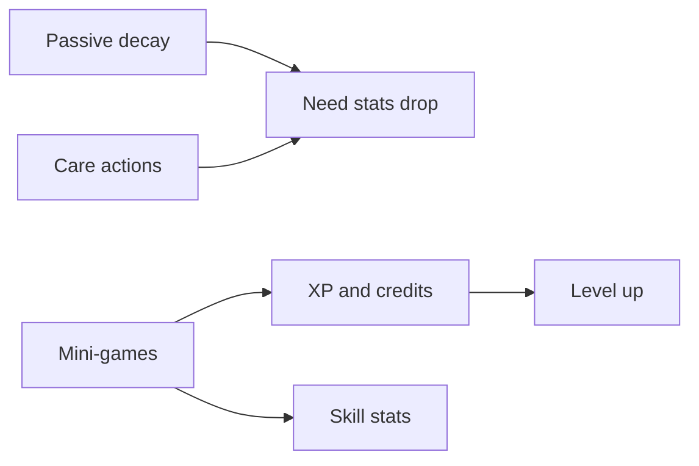

# Game Design — Future Pets

This document is the game design bible. Balance values marked **TUNABLE** live in [`src/lib/constants/game.ts`](../src/lib/constants/game.ts).

---

## Vision

Future Pets is a long-horizon companion game. Progress is measured in days and weeks, not single sessions. Players invest in one or more pets, discover rare rolls at creation, train stats through mini-games, earn currency, visit other players, trade cosmetics, and eventually breed new companions.

Tone: playful but not childish. Audience: teens and adults.

---

## Core loop (hybrid care model)

1. **Passive decay** — Need stats (hunger, happiness, health, energy) slowly decrease over real time.
2. **Active care** — Feed, play, rest, and heal restore stats (with cooldowns).
3. **Session spikes** — Mini-games grant large XP, credits, and skill stat gains.
4. **Long-term growth** — Level, XP, inventory, and cosmetics accumulate over time.



---

## Starter pet creation

### Species selection

Players choose **one of five starter species** during onboarding:

| ID | Name | Element | Identity |
|----|------|---------|----------|
| `emberfox` | Emberfox | Fire | Fast, high energy/speed |
| `tidefin` | Tidefin | Water | Balanced all-rounder |
| `leafhorn` | Leafhorn | Nature | Tanky, high health/defense |
| `voltail` | Voltail | Electric | High intelligence/speed |
| `crystwing` | Crystwing | Crystal | High variance rolls |

Placeholder art: `public/pets/placeholders/{speciesId}.svg`

### Onboarding choices

Three choice groups modify stat rolls (not guaranteed max stats — they bias the roll):

| Choice | Options | Effect |
|--------|---------|--------|
| Play style | adventurer, caretaker, competitor | Biases energy/speed, happiness/health, or strength/defense |
| Favorite element | fire, water, nature, electric, crystal | Small bonus if matched to species element |
| Personality | bold, calm, curious | Biases strength/happiness, health/defense, or intelligence/happiness |

Exact bias values: **TUNABLE** in `ONBOARDING_STAT_BIAS` in `game.ts`.

### Rarity roll at creation

When a pet is created, the server rolls a **rarity tier** (never trust the client):

| Tier | Default weight | Notes |
|------|----------------|-------|
| Common | 75% | Standard roll |
| Uncommon | 18% | Slightly elevated stats |
| Rare | 5.9% | Notably strong starter |
| Shiny | 1% | Distinct visual treatment + stat boost |
| Super | 0.1% | Top-tier roll; celebratory reveal UX |

Weights and multipliers: **TUNABLE** in `RARITY_WEIGHTS` and `RARITY_STAT_MULTIPLIERS`.

**Server-side requirement:** Phase 1+ must use a Cloud Function to roll rarity and stats. Log the roll seed server-side for audit.

### Stat roll algorithm (reference)

For each stat in `NEED_STATS` + `SKILL_STATS`:

1. Look up species `baseStats[stat]` → `[min, max]`.
2. Roll uniform value in range.
3. Apply onboarding bias (clamped to stat min/max).
4. Multiply by rarity tier multiplier.
5. Clamp to `[STAT_MIN, STAT_MAX]` (0–100).

---

## Stats

All stats use a **0–100** scale unless noted.

### Need stats (passive decay)

| Stat | Decay/hr (default) | Restored by |
|------|-------------------|-------------|
| Hunger | 1.2 | Feed |
| Happiness | 0.8 | Play, feed, some mini-games |
| Health | 0.3 | Rest, heal, items |
| Energy | 0.9 | Rest, feed |

When hunger or happiness hits 0, health decay accelerates. When energy hits 0, mini-games are blocked.

### Progression

| Field | Behavior |
|-------|----------|
| Level | Increases when XP threshold met |
| XP | From mini-games, daily care streaks, achievements |

XP to next level: `XP_PER_LEVEL_BASE * XP_LEVEL_SCALING ^ (level - 1)` — **TUNABLE**.

### Skill stats (no passive decay)

| Stat | Trained by |
|------|------------|
| Strength | Combat mini-games, training items |
| Speed | Reflex mini-games |
| Defense | Endurance mini-games |
| Intelligence | Puzzle mini-games |

Combat use (PvE arenas) is a Phase 4+ feature. Stats are stored from Phase 1 for forward compatibility.

---

## Care actions

| Action | Cooldown | Primary effect | Side effects |
|--------|----------|----------------|--------------|
| Feed | 30 min | +25 hunger | +5 happiness |
| Play | 20 min | +20 happiness | −10 energy |
| Rest | 45 min | +30 energy | +5 health |
| Heal | 60 min | +25 health | Costs 50 credits |

Cooldowns are per-pet. UI shows next available action time.

---

## Economy

### Currency: Credits

- Starting balance: **500 credits** (TUNABLE)
- Earned from: mini-games, daily login, achievements, selling items (Phase 3+)
- Spent on: food, toys, cosmetics, heal action, shop items

### Shop (Phase 3+)

- **Cosmetic items** — pet accessories, profile themes, emotes
- **Consumables** — food, toys (boost care action effectiveness)
- No stat items sold for real money

### Monetization (Phase 7)

- **Cosmetic IAP only** — premium cosmetics, battle pass cosmetics
- Premium currency (if added) converts to cosmetics only; never direct stat purchases
- Document IAP product IDs in Firestore `shop/iapProducts` when implemented

---

## Mini-games (roadmap)

Placeholder game IDs for planning:

| ID | Category | Rewards |
|----|----------|---------|
| `reflex-dash` | Speed training | Speed XP, credits |
| `memory-match` | Intelligence | Intelligence XP, credits |
| `tug-of-war` | Strength | Strength XP, credits |
| `block-parry` | Defense | Defense XP, credits |
| `daily-spin` | Currency | Credits, rare item chance |

Each session writes to `miniGameSessions/{sessionId}` with score, timestamp, and anti-cheat metadata. Server validates reward claims.

---

## Social: visits

Public pet profile URL pattern:

```
/u/[username]/pet/[petId]
```

Visitors see: pet name, species, rarity, level, equipped cosmetics, public stats (not exact cooldown timers). Read-only in Phase 3.

---

## Trading (Phase 5)

### Flow

1. Player A creates trade offer (items and/or credits).
2. Player B accepts or counter-offers.
3. Cloud Function validates ownership, locks items in escrow.
4. Atomic swap on acceptance; either party can cancel before lock.

### Anti-scam rules

- Trade history logged immutably
- New accounts have trade cooldown (7 days — TUNABLE)
- High-value trades require email-verified accounts
- No pet trading until breeding Phase 6 (pets are soulbound until then; cosmetics/tradables only in Phase 5)

---

## Breeding / matching (Phase 6)

### Overview

Two players match compatible pets to produce an **egg**. Egg hatches after a real-time incubation period into a new pet with inherited genetics.

### Compatibility rules (draft)

- Both pets must be level 10+ (TUNABLE)
- Breeding cooldown per pet: 7 days (TUNABLE)
- Same species → offspring of that species
- Different species → offspring from weighted species table (parent-weighted)
- Shiny/super parents increase shiny roll chance (not guaranteed)

### Inheritance

- Each stat: `round((parentA.stat + parentB.stat) / 2 + random(-5, 5))`
- Rarity roll uses standard weights with parent bonus
- New pet gets fresh need stats; skill stats inherit with variance

### Egg / hatch flow

1. Match confirmed → `breedingPairs/{pairId}` created
2. Both players pay credits fee (TUNABLE)
3. Egg appears in both inventories (linked egg ID)
4. Incubation timer (24–72 hr — TUNABLE)
5. Hatch Cloud Function creates `users/{uid}/pets/{petId}` for each owner (one offspring each, or shared — **TBD: one egg → one owner**)

---

## Pet visuals

- **Phase 0–2:** Single static image per pet state (placeholder SVG per species)
- **Phase 3+:** Cosmetic layers composited on base image (Firebase Storage)
- **Shiny/Super:** Alternate palette or border effect on same base image until full art pipeline

---

## Open decisions (TBD)

Track these in roadmap issues as they are resolved:

- [ ] Exact onboarding copy and UX flow order
- [ ] PvE combat format (auto-battle vs interactive)
- [ ] One offspring per breeding pair vs one per parent
- [ ] Maximum pets per account (suggest 5 at launch)
- [ ] Daily login reward table

When resolved, update this file and `game.ts`.
