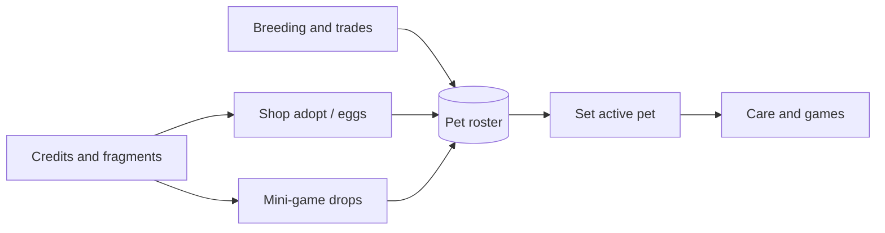
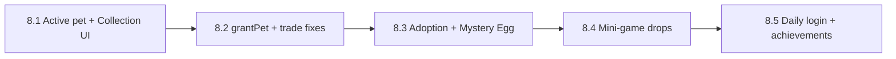

# Pet Acquisition & Collection — Future Pets

Design specification for how players obtain additional pets beyond their onboarding starter, and how pets and items are displayed in a unified Collection UI.

**Status:** Phase 8 (planned)  
**Monetization constraint:** No real-money pet purchases. Pets are earned via credits, breeding, trades, and gameplay. IAP remains cosmetic-only (Phase 7).

**Related docs:** [GAME_DESIGN.md](GAME_DESIGN.md), [ARCHITECTURE.md](ARCHITECTURE.md), [ROADMAP.md](ROADMAP.md)

---

## Overview

Future Pets is designed as a long-horizon collection game. Players start with one starter pet from onboarding, then grow a roster of up to **5 pets** through social play, credit spending, and engagement rewards.

The collection loop:



Phase 8 delivers:

1. **Multiple acquisition channels** — breeding (existing), credit adoption, mystery eggs, mini-game drops, daily login, achievements
2. **Active pet selection** — `activePetId` on user doc; dashboard and games target the selected pet
3. **Collection page** — `/collection` with Pets and Items tabs
4. **Shared backend** — `grantPet()` helper used by all server-side pet creation paths

---

## Current acquisition paths (shipped)

| Path | Cloud Function | Constraints |
|------|----------------|-------------|
| Onboarding starter | `createStarterPet` | One per account (`onboardingComplete` guard) |
| Breeding hatch | `hatchEgg` | Max 5 pets (`BREEDING_MAX_PETS`); egg from `respondBreeding` |
| P2P trade swap | `executeTrade` | Swap-only; receiver must have **exactly 1 pet** today |

**Key files:**

- `functions/src/createStarterPet.ts` — rarity roll, stat bias from onboarding choices
- `functions/src/hatchEgg.ts` — offspring from breeding pair inheritance
- `functions/src/executeTrade.ts` — atomic pet transfer via `transferPet()`
- `src/features/pets/usePet.ts` — returns **oldest pet only** (`orderBy createdAt, limit 1`)

**Gaps:**

- No `activePetId`; UI assumes single pet
- No collection/roster page
- Shop sells cosmetics only (`SHOP_ITEMS`, `IAP_ITEMS` in `game.ts`)
- Mini-games grant credits/XP only — no drop tables
- `BREEDING_MAX_PETS` enforced on hatch but not on trade receive
- Trade swap blocked for multi-pet accounts

---

## Proposed acquisition paths

All new pets must pass through a server-side `grantPet()` helper (see [Backend](#backend-cloud-functions)). No client-side pet creation.

### Tier 1 — Existing systems + credit shop

#### 1. Breeding (existing — UX polish)

Primary long-term, social pet source. Each parent receives one offspring per completed breeding pair.

- **Policy:** One offspring per parent per pair (resolves GAME_DESIGN TBD)
- **Phase 8 fix:** Remove "exactly 1 pet" guard in `executeTrade` for pet swaps; add pet picker to trade UI
- **Cap:** Enforce `MAX_PETS` on trade receive (same as hatch)

#### 2. Credit adoption (shop)

Players adopt starter species they do not yet own.

| Constant | Default | Notes |
|----------|---------|-------|
| `ADOPTION_CREDITS_PRICE` | 3,000 | Per species — TUNABLE |
| `ADOPTION_ONE_PER_SPECIES` | `true` | Gray out owned species in shop |
| `MAX_PETS` | 5 | Renamed from `BREEDING_MAX_PETS` |

**Flow:**

1. Shop → **Adopt** tab → pick species → enter name → confirm
2. Callable `adoptPet({ speciesId, petName })` deducts credits, calls `grantPet()` with `acquiredVia: "adoption"`
3. Rarity rolled server-side (standard `RARITY_WEIGHTS`); no onboarding stat bias (neutral roll)

**Catalog:** `ADOPTION_OFFERS` in `game.ts` — mirrors `STARTER_SPECIES` with `creditsPrice` per entry.

#### 3. Mystery Egg (credit sink)

Random species + rarity roll. Good for players who want surprise over choice.

| Constant | Default | Notes |
|----------|---------|-------|
| `MYSTERY_EGG_CREDITS_PRICE` | 1,500 | Shop purchase — TUNABLE |
| `MYSTERY_EGG_HATCH_DELAY_HOURS` | 0 | Instant hatch for v1; 0–4 hr optional later |
| `MYSTERY_EGG_SPECIES_WEIGHTS` | Starter table | Expand when non-starter species ship |

**Flow:**

1. Shop → **Eggs** tab → buy `mystery-egg` → `purchaseItem` writes inventory doc
2. Collection → Items → Eggs → **Hatch** → `hatchMysteryEgg({ inventoryDocId, petName })`
3. Server rolls species from weight table + standard rarity; calls `grantPet()` with `acquiredVia: "mystery_egg"`

### Tier 2 — Engagement rewards

#### 4. Mini-game rare drops

Extend `computeMiniGameRewards()` with a pet capsule drop table.

| Constant | Default | Notes |
|----------|---------|-------|
| `PET_CAPSULE_DROP_RATE` | 0.005 (0.5%) | Per qualifying session — TUNABLE |
| `PET_CAPSULE_MIN_SCORE` | 30 | Must exceed threshold — TUNABLE |
| `PET_CAPSULE_DAILY_CAP` | 1 | Max drops per user per day — TUNABLE |
| `PET_CAPSULE_PITY_GAMES` | 100 | Guaranteed drop after N qualifying games without drop — TUNABLE |

**Flow:**

1. `claimMiniGameReward` validates score as today
2. If eligible (score ≥ min, pet count < `MAX_PETS`, under daily cap): roll drop
3. On success: write `pet-capsule` to inventory; increment `petCapsulePityCounter` on user doc (reset on drop)
4. Player hatches capsule via Collection → `hatchPetCapsule({ inventoryDocId, petName })`

**Analytics:** `pet_capsule_dropped`, `pet_capsule_hatched`

#### 5. Daily login / streak rewards

Callable `claimDailyLogin()` (once per calendar day per user).

| Streak day | Reward |
|------------|--------|
| 1 | 25 credits |
| 2 | 50 credits |
| 3 | 1 egg fragment |
| 4 | 75 credits |
| 5 | 1 egg fragment |
| 6 | 100 credits |
| 7 | 1 mystery egg (or 2 fragments if at pet cap) |

Streak resets if user misses a day. Constants: `DAILY_LOGIN_REWARDS` in `game.ts`.

**Crafting:** 5 `egg-fragment` → callable `craftMysteryEgg()` → 1 `mystery-egg` inventory item.

#### 6. Achievement milestones

Server-written `users/{uid}/achievements/{achievementId}`.

| Achievement ID | Trigger | Reward |
|----------------|---------|--------|
| `level_10` | Any pet reaches level 10 | 200 credits |
| `games_25` | 25 mini-game completions | 1 egg fragment |
| `first_trade` | Complete first trade | 150 credits |
| `first_hatch` | Hatch first breeding egg | 1 egg fragment |
| `species_collector` | Own all 5 starter species | 500 credits + profile badge |

Callable `checkAchievements()` runs after relevant actions (or client triggers check on dashboard load). Rewards granted server-side.

### Tier 3 — Future expansion (document only)

- **Weekly quests** — e.g. "Play 3 games + feed 5 times" → egg fragment
- **Seasonal species** — added to `MYSTERY_EGG_SPECIES_WEIGHTS` during events (not IAP)
- **Expanded species catalog** — `species/{speciesId}` beyond starters; adoption/eggs pull from catalog; onboarding keeps 5 starters only

### Explicitly out of scope

- Direct pet IAP or Stripe pet SKUs
- Pay-to-win rarity boosts or stat items affecting pet creation rolls
- Premium currency that converts to pets

---

## Economy balance

Mini-game credits: `15 + floor(score × 1.5)` → typical session **30–80 credits**.

| Sink | Price | Games to earn (approx.) |
|------|-------|-------------------------|
| Mystery Egg | 1,500 credits | 20–50 |
| Species adoption | 3,000 credits | 40–100 |
| Breeding fee | 100 credits (existing) | 2–4 |
| Heal care | 50 credits | 1–2 |
| Cosmetic item | 150–350 credits | 3–12 |

Mystery Egg uses standard `RARITY_WEIGHTS` (same expected value as starter). Adoption lets player pick species; rarity still server-rolled.

F2P path: daily login streak (day 7 mystery egg) + pity-guaranteed capsule after 100 qualifying games provides pets without spending credits, but slower than shop adoption.

---

## Collection UI specification

### Navigation

Update `AppHeader` nav:

| Label | Route | Purpose |
|-------|-------|---------|
| Dashboard | `/dashboard` | Active pet care, stats, mini-game entry |
| Collection | `/collection` | Pet roster + item inventory |
| Games | `/games` | Mini-game hub |
| Shop | `/shop` | Purchase cosmetics, adoptions, eggs |
| Trades | `/trades` | P2P trading |
| Breed | `/breeding` | Breeding matches |

Rename current **"My pet"** → **"Dashboard"**.

### Active pet selection

**User doc field:**

```typescript
activePetId?: string;  // falls back to oldest pet by createdAt if unset or invalid
```

**Client:**

- `ActivePetProvider` (or extend `AuthProvider`) subscribes to `usePets()` + user doc
- Refactor `usePet()` to resolve `activePetId` against owned pets
- **Pet switcher** on dashboard: horizontal scroll or dropdown of pet cards
- Setting active pet: client write to `users/{uid}.activePetId` (allowed by current rules)

**Server:**

- All pet-targeting callables already accept `petId` (`performCareAction`, `startMiniGameSession`, etc.)
- UI must pass active pet's id, not always the oldest

### `/collection` page

Route: `src/app/collection/page.tsx` → `CollectionPage` feature component.

**Layout:** Two tabs (shadcn `Tabs`).

#### Pets tab

- Grid of pet cards: species image, name, rarity badge, level, shiny/super border
- Active pet: **Active** chip
- Per-card actions: **Set active**, **View profile** (`/pet-profile?petId=`), **Rename** (existing flow)
- Cap indicator: `3 / 5 pets`
- Empty slots (< `MAX_PETS`): CTA cards → Shop (Adopt / Mystery Egg), Breeding, Games

#### Items tab

Grouped sections:

| Section | Item IDs | Actions |
|---------|----------|---------|
| Cosmetics | `SHOP_ITEMS`, `IAP_ITEMS` | Equip / unequip on **active pet** |
| Eggs | `breeding-egg`, `mystery-egg` | Show hatch timer; **Hatch** when ready |
| Capsules | `pet-capsule` | **Hatch** → name pet |
| Materials | `egg-fragment` | Show count; **Craft** (5 → 1 mystery egg) |
| Vouchers | `adoption-voucher` | Redeem for guaranteed uncommon adoption (future) |

Reuse `useInventory()` and `findCosmeticItem()`. Move primary equip flow here; Shop remains purchase-focused (optional quick-equip kept for convenience).

**Fix:** Pet profile page should resolve IAP cosmetic names via `findCosmeticItem()`, not `SHOP_ITEMS` only.

### Shop page adjustments

| Tab | Content |
|-----|---------|
| Cosmetics | Existing credit items (buy; equip optional) |
| Adopt | Species cards, credit price, owned species disabled |
| Eggs | Mystery Egg purchase |
| Premium | Existing IAP section (cosmetics only) |

---

## Firestore schema changes

### `users/{uid}` (additions)

```typescript
{
  // ... existing fields ...
  activePetId?: string;
  petCapsulePityCounter?: number;   // qualifying games since last drop
  lastDailyLoginClaimAt?: Timestamp;
  dailyLoginStreak?: number;
}
```

### `users/{uid}/pets/{petId}` (additions)

```typescript
{
  // ... existing fields ...
  acquiredVia?: "starter" | "breeding" | "adoption" | "mystery_egg" | "drop" | "trade";
}
```

### `users/{uid}/inventory/{docId}` (extended shapes)

Standard cosmetic (unchanged):

```typescript
{ itemId: string; quantity: number; acquiredAt: Timestamp; source?: "iap" }
```

Egg / capsule (timed hatch):

```typescript
{
  itemId: "breeding-egg" | "mystery-egg" | "pet-capsule";
  quantity: 1;
  acquiredAt: Timestamp;
  hatchAt?: Timestamp;           // mystery-egg if delayed hatch enabled
  breedingPairId?: string;       // breeding-egg only
}
```

Material:

```typescript
{ itemId: "egg-fragment"; quantity: number; acquiredAt: Timestamp }
```

### `users/{uid}/achievements/{achievementId}` (new)

```typescript
{
  unlockedAt: Timestamp;
  rewardClaimed: boolean;
}
```

Client: read-only. Server writes on unlock and claim.

### Constants rename

`BREEDING_MAX_PETS` → `MAX_PETS` in `src/lib/constants/game.ts` and `functions/src/constants.ts` (alias old name during migration if needed).

---

## Backend: Cloud Functions

### Shared `grantPet()` helper

Extract from `createStarterPet.ts` and `hatchEgg.ts`:

```typescript
// functions/src/grantPet.ts
grantPet(tx, uid, {
  speciesId: string;
  name: string;
  acquiredVia: AcquiredVia;
  rarity?: RarityTier;           // rolled if omitted
  stats?: Record<PetStat, number>; // rolled if omitted
  rollOptions?: {
    onboardingBias?: OnboardingBias;  // starter only
    parentStats?: [Record, Record];   // breeding only
  };
  bredFromPairId?: string;
}): { petId: string; rarity: RarityTier }
```

**Every caller must:**

1. Verify `pets.count < MAX_PETS` inside the transaction
2. Roll rarity/stats server-side (never trust client)
3. Set `acquiredVia` on pet doc
4. Return `petId` for analytics / UI

### New callables

| Function | Input | Purpose |
|----------|-------|---------|
| `adoptPet` | `{ speciesId, petName }` | Credit adoption from shop |
| `hatchMysteryEgg` | `{ inventoryDocId, petName }` | Consume egg, grant pet |
| `hatchPetCapsule` | `{ inventoryDocId, petName }` | Consume capsule, grant pet |
| `craftMysteryEgg` | `{}` | 5 fragments → 1 mystery egg |
| `claimDailyLogin` | `{}` | Once per day streak reward |
| `checkAchievements` | `{}` | Evaluate and grant milestone rewards |

### Modified callables

| Function | Change |
|----------|--------|
| `createStarterPet` | Delegate to `grantPet()` |
| `hatchEgg` | Delegate to `grantPet()` |
| `claimMiniGameReward` | Add pet capsule drop roll + pity counter |
| `executeTrade` | Enforce `MAX_PETS` on receive; remove single-pet swap guard; support pet picker |
| `purchaseItem` | Allow `mystery-egg` SKU |

---

## Anti-abuse

| Risk | Mitigation |
|------|------------|
| Client forging pets | All pet docs created only in Cloud Functions |
| Drop farming | Daily drop cap, minimum score threshold, pity counter server-side |
| Credit duplication | Adoption/egg purchase in Firestore transactions |
| Trade over-cap | Check recipient pet count before `transferPet` |
| Duplicate adoption | Server checks owned species when `ADOPTION_ONE_PER_SPECIES` |
| IAP pet bypass | No pet SKUs in Stripe catalog; `purchaseItem` rejects non-catalog IDs |

---

## Analytics events

| Event | When |
|-------|------|
| `pet_adopted` | `adoptPet` success — `species_id`, `rarity`, `credits_spent` |
| `mystery_egg_purchased` | Shop buy |
| `mystery_egg_hatched` | `hatchMysteryEgg` — `species_id`, `rarity` |
| `pet_capsule_dropped` | Mini-game drop — `game_id`, `score` |
| `pet_capsule_hatched` | `hatchPetCapsule` — `species_id`, `rarity` |
| `active_pet_changed` | Client sets `activePetId` — `pet_id`, `species_id` |
| `daily_login_claimed` | `claimDailyLogin` — `streak_day` |
| `achievement_unlocked` | `checkAchievements` — `achievement_id` |
| `egg_fragment_crafted` | `craftMysteryEgg` |

Existing: `pet_created` (starter), breeding/trade events as applicable.

---

## Implementation phases

See [ROADMAP.md Phase 8](ROADMAP.md) for acceptance criteria.



| Sub-phase | Deliverables | Key files |
|-----------|--------------|-----------|
| **8.1** | `activePetId`, pet switcher, `/collection`, nav | `usePet.ts`, `AppHeader.tsx`, `CollectionPage.tsx`, `auth/types.ts` |
| **8.2** | `grantPet()`, trade cap + multi-pet picker | `grantPet.ts`, `executeTrade.ts`, `CreateTradeForm.tsx` |
| **8.3** | Shop adopt/eggs, `adoptPet`, `hatchMysteryEgg` | `game.ts`, `ShopPage.tsx`, new functions |
| **8.4** | Drop table, pity counter, `hatchPetCapsule` | `claimMiniGameReward.ts`, `game.ts` |
| **8.5** | Daily login, achievements, crafting | New functions, `CollectionPage` items section |

---

## Open questions

Track in ROADMAP / issues until resolved:

- [ ] **Mystery egg hatch delay** — instant (v1) vs 1–4 hr timer for anticipation
- [ ] **Adoption duplicates** — enforce one-per-species (recommended) or allow duplicates
- [ ] **Pet capsule species pool** — starters only vs full catalog when expanded
- [ ] **Collection equip vs shop equip** — remove shop equip entirely or keep quick-equip
- [ ] **Achievement badges on public profile** — which achievements are visible

When resolved, update this file, `GAME_DESIGN.md`, and `game.ts`.

---

## Related documents

- [GAME_DESIGN.md](GAME_DESIGN.md) — stats, economy, breeding rules
- [ARCHITECTURE.md](ARCHITECTURE.md) — schema and security patterns
- [ROADMAP.md](ROADMAP.md) — Phase 8 acceptance criteria
- [AI_DEVELOPMENT_GUIDE.md](AI_DEVELOPMENT_GUIDE.md) — Phase 8 prompt templates
