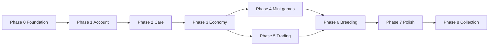

# Roadmap — Future Pets

Phased build plan with acceptance criteria, likely files, Firebase changes, and AI prompt templates.

**Current phase: 8 (next)**

---

## Phase 0 — Foundation

**Goal:** Runnable app, landing page, documentation, and project conventions.

### Deliverables

- Next.js + TypeScript + Tailwind + shadcn/ui scaffold
- Landing page (hero, feature cards, Phase 1 CTA placeholder)
- `src/lib/constants/game.ts` with tunable balance values
- Placeholder pet SVGs for 5 starter species
- Firebase config stubs (rules deny-all until Phase 1)
- Full documentation suite

### Acceptance criteria

- [x] `npm run dev` serves landing page at localhost:3000
- [x] `npm run build` passes
- [x] README + 5 docs files exist with substantive content
- [x] No Firebase secrets committed

### AI prompt template

> Implement Phase 0 for Future Pets: scaffold Next.js App Router with TypeScript, Tailwind, shadcn/ui, a landing page, game constants stub, placeholder pet assets, Firebase stubs, and the full docs suite per README and plan.

---

## Phase 1 — Account + pet

**Goal:** Google Sign-In, onboarding, server-side starter pet roll, pet dashboard.

### Deliverables

1. Firebase SDK init (`src/lib/firebase/client.ts`)
2. Google Sign-In button + auth context (`src/features/auth/`)
3. Onboarding wizard: species pick + 3 choice groups (`src/features/onboarding/`)
4. Cloud Function `createStarterPet` — rarity + stat roll
5. Pet dashboard showing stats, rarity, species image (`src/features/dashboard/`)
6. Firestore rules: users + pets read/write own data
7. Deploy auth config (`firebase deploy --only auth`)

### Likely files

```
src/features/auth/
  AuthProvider.tsx
  SignInButton.tsx
  useAuth.ts
src/features/onboarding/
  OnboardingWizard.tsx
  SpeciesPicker.tsx
src/features/pets/
  types.ts
  usePet.ts
src/features/dashboard/
  PetDashboard.tsx
  StatBar.tsx
src/app/dashboard/page.tsx
src/app/onboarding/page.tsx
functions/src/createStarterPet.ts
```

### Firebase changes

- Enable Google Auth
- Firestore `users`, `users/{uid}/pets`, `species` collections
- Callable Function for pet creation
- Update `firestore.rules` for Phase 1

### Acceptance criteria

- [x] User can sign in with Google
- [x] New user completes onboarding and receives one pet
- [x] Pet stats reflect species, onboarding choices, and rarity roll
- [x] Rarity roll happens server-side only (createStarterPet Cloud Function)
- [x] Dashboard displays all 8 stats + level/XP
- [x] User cannot create a second starter pet without admin override

### AI prompt template

> Implement Phase 1.1: Add Firebase client SDK initialization using env vars from .env.example, create AuthProvider and Google SignInButton, replace the disabled landing CTA with working sign-in. Follow docs/AI_DEVELOPMENT_GUIDE.md.

> Implement Phase 1.2: Build onboarding wizard (species + play style + element + personality), Cloud Function createStarterPet with rarity roll from game.ts constants, and route new users to /onboarding before /dashboard.

> Implement Phase 1.3: Build pet dashboard at /dashboard showing pet image, name, rarity badge, and all stats with shadcn progress bars.

---

## Phase 2 — Care loop

**Goal:** Feed/play/rest/heal actions, stat decay, cooldowns.

### Deliverables

- Care action buttons with cooldown timers
- Decay applied on dashboard load (`lastDecayAppliedAt`)
- Firestore updates for stat changes
- Low-stat warnings (hunger/happiness at 0)
- Pet rename (one free rename)

### Firebase changes

- Optional scheduled Function `applyStatDecay` (hourly)
- Index on `users/{uid}/pets` if querying multiple pets

### Acceptance criteria

- [x] Each care action updates stats and enforces cooldown
- [x] Decay applies correctly based on elapsed time
- [x] Heal deducts credits
- [x] Stats clamped to 0–100

### AI prompt template

> Implement Phase 2: Add care actions (feed, play, rest, heal) to the pet dashboard with cooldowns from game.ts CARE_ACTIONS, apply passive decay on load using DECAY_PER_HOUR, and persist updates to Firestore.

---

## Phase 3 — Economy + social

**Goal:** Credits, cosmetic shop, public profiles, visit pages.

### Deliverables

- Credits balance on user doc (starting 500)
- Shop UI with cosmetic items (seed `items` collection)
- Inventory subcollection
- Username selection (unique index)
- Public profile route `/u/[username]/pet/[petId]`
- Visit other players (read-only)

### Firebase changes

- `items`, `users/{uid}/inventory`, `usernames/{username}`
- Security rules for public profile reads
- Storage for purchased cosmetic assets

### Acceptance criteria

- [x] User can spend credits in shop
- [x] Cosmetics equip on pet (visual placeholder OK)
- [x] Public URL shows pet without auth
- [x] Usernames unique and validated

### AI prompt template

> Implement Phase 3.1: Add credits balance, shop page with 5 seed cosmetic items, purchase flow writing to inventory, and equip cosmetic on pet dashboard.

> Implement Phase 3.2: Add username setup, public pet profile page at /u/[username]/pet/[petId], and Firestore rules for public read of pet profile fields.

---

## Phase 4 — Mini-games

**Goal:** 1–2 playable mini-games with server-validated rewards.

### Deliverables

- Mini-game hub page
- `reflex-dash` (speed) and `memory-match` (intelligence) — start with 2
- game should be built using Phaserjs | Docs: (https://phaser.io/tools/phaser-docs)
- if possible maybe have a live connection to the database to counteract frontend manipulation
- Session tracking in `miniGameSessions`
- Callable Function `claimMiniGameReward`
- XP + credits granted on completion

### Acceptance criteria

- [x] Games playable in browser
- [x] Rewards only granted via Cloud Function after score validation
- [x] Skill stats and XP update on pet doc
- [x] Energy cost to play (optional — TUNABLE)

### AI prompt template

> Implement Phase 4: Add mini-game hub with reflex-dash and memory-match games, write sessions to Firestore, and Cloud Function claimMiniGameReward that validates score and grants XP/credits/skill stats per GAME_DESIGN.md.

---

## Phase 5 — Trading

**Goal:** Player-to-player item/credits trading with escrow.

### Deliverables

- Trade offer UI (create, accept, cancel)
- `trades/{tradeId}` collection
- Cloud Function `executeTrade` with atomic swap
- Trade history log
- New account trade cooldown (7 days)

### Acceptance criteria

- [x] Items locked in escrow during pending trade
- [x] Atomic swap on accept; no duplication exploits
- [x] Trade history visible to both parties
- [x] Pets are tradable (swap-only between two players)

### AI prompt template

> Implement Phase 5: Add trade offer system for items and credits with escrow via Cloud Function executeTrade, trade cooldown for new accounts, and trade history UI.

---

## Phase 6 — Breeding

**Goal:** Match pets, incubate eggs, hatch offspring.

### Deliverables

- Breeding match UI (invite partner pet)
- Compatibility checks (level, cooldown)
- `breedingPairs/{pairId}` + egg inventory item
- Hatch Cloud Function with inheritance algorithm from GAME_DESIGN.md
- Shiny parent bonus on offspring roll

### Acceptance criteria

- [x] Two players can initiate breeding pair
- [x] Egg incubates over real time
- [x] Hatch creates new pet with inherited stats + rarity roll
- [x] Breeding cooldown enforced per pet

### AI prompt template

> Implement Phase 6: Add breeding match flow, egg incubation timer, hatch Cloud Function using inheritance rules in GAME_DESIGN.md, and offspring pet creation.

---

## Phase 7 — Polish + IAP

**Goal:** Production readiness, cosmetic IAP, analytics, deploy.

### Deliverables

- [x] Cosmetic IAP integration (Stripe Checkout + webhook)
- [x] Analytics events (sign-up, pet created, mini-game played, purchase)
- [x] Error monitoring (ErrorBoundary + `app_error` analytics)
- [x] Performance pass on dashboard and games (memoized StatBar, hosting cache headers)
- [x] Shiny/super visual treatments

### Acceptance criteria

- [x] IAP purchases grant cosmetic items only
- [x] Core flows monitored with analytics
- [x] No pay-to-win paths in shop or IAP

### AI prompt template

> Implement Phase 7.2: Add cosmetic IAP flow (document product IDs), analytics events for key funnel steps, and shiny/super visual badges on pet dashboard.

---

## Phase 8 — Collection & acquisition

**Goal:** Multi-pet roster, unified collection UI, and credit/gameplay pet acquisition (no real-money pets).

Full design: [PET_ACQUISITION_AND_COLLECTION.md](PET_ACQUISITION_AND_COLLECTION.md)

### Sub-phases

#### 8.1 — Active pet + Collection UI

**Deliverables:**

- `activePetId` on user doc; pet switcher on dashboard
- `/collection` page with Pets tab (roster grid, set active, empty-slot CTAs)
- AppHeader nav: rename "My pet" → "Dashboard"; add "Collection"
- Refactor `usePet()` to resolve active pet (fallback: oldest by `createdAt`)

**Likely files:**

```
src/features/auth/types.ts
src/features/pets/usePet.ts
src/features/pets/usePets.ts
src/features/collection/CollectionPage.tsx
src/app/collection/page.tsx
src/components/AppHeader.tsx
```

#### 8.2 — `grantPet` refactor + trade fixes

**Deliverables:**

- Shared `grantPet()` helper; refactor `createStarterPet` and `hatchEgg`
- Rename `BREEDING_MAX_PETS` → `MAX_PETS` in `game.ts` and `functions/src/constants.ts`
- `acquiredVia` field on new pet docs
- Enforce `MAX_PETS` on trade receive; remove single-pet swap guard
- Pet picker in trade UI for multi-pet accounts

**Likely files:**

```
functions/src/grantPet.ts
functions/src/createStarterPet.ts
functions/src/hatchEgg.ts
functions/src/executeTrade.ts
src/features/trading/CreateTradeForm.tsx
```

#### 8.3 — Credit adoption + Mystery Egg

**Deliverables:**

- `ADOPTION_OFFERS` and `MYSTERY_EGG_*` constants in `game.ts`
- Shop tabs: Adopt, Eggs (plus existing Cosmetics, Premium IAP)
- Callables: `adoptPet`, `hatchMysteryEgg`
- `purchaseItem` supports `mystery-egg` SKU
- Collection Items tab: eggs section with hatch flow

**Likely files:**

```
src/lib/constants/game.ts
functions/src/constants.ts
functions/src/adoptPet.ts
functions/src/hatchMysteryEgg.ts
functions/src/purchaseItem.ts
src/features/shop/ShopPage.tsx
src/features/collection/CollectionPage.tsx
```

#### 8.4 — Mini-game pet drops

**Deliverables:**

- Pet capsule drop table in `computeMiniGameRewards` / `claimMiniGameReward`
- Pity counter on user doc; daily drop cap
- Callable `hatchPetCapsule`
- Collection Items tab: capsules section
- Analytics: `pet_capsule_dropped`, `pet_capsule_hatched`

**Likely files:**

```
src/lib/constants/game.ts
functions/src/claimMiniGameReward.ts
functions/src/hatchPetCapsule.ts
src/features/collection/CollectionPage.tsx
```

#### 8.5 — Daily login + achievements

**Deliverables:**

- `DAILY_LOGIN_REWARDS` table; callable `claimDailyLogin`
- `users/{uid}/achievements/{id}` subcollection; callable `checkAchievements`
- Egg fragment crafting: `craftMysteryEgg` (5 fragments → 1 mystery egg)
- Collection Items tab: materials and vouchers sections

**Likely files:**

```
src/lib/constants/game.ts
functions/src/claimDailyLogin.ts
functions/src/checkAchievements.ts
functions/src/craftMysteryEgg.ts
src/features/collection/CollectionPage.tsx
firestore.rules
```

### Firebase changes

- User doc: `activePetId`, `petCapsulePityCounter`, `lastDailyLoginClaimAt`, `dailyLoginStreak`
- Pet doc: `acquiredVia`
- Inventory: extended shapes for eggs, capsules, fragments
- New subcollection: `users/{uid}/achievements`
- New callables listed above; export from `functions/src/index.ts`

### Acceptance criteria

- [ ] User with multiple pets can switch active pet; dashboard/games target active pet
- [ ] `/collection` shows pet roster (up to 5) and grouped item inventory
- [ ] User can adopt an unowned starter species for credits via shop
- [ ] User can buy and hatch a Mystery Egg for a server-rolled pet
- [ ] Mini-game exceptional sessions can drop a pet capsule (rate-limited, pity system)
- [ ] Daily login streak grants credits and egg fragments; 5 fragments craft a mystery egg
- [ ] Achievements unlock and grant rewards server-side
- [ ] All new pets created only via `grantPet()`; `MAX_PETS` enforced on hatch, adoption, drops, and trades
- [ ] No real-money pet purchases; IAP remains cosmetic-only
- [ ] Analytics events fire for each acquisition source

### AI prompt template

> Implement Phase 8.1 for Future Pets: Add `activePetId` to user doc, refactor `usePet()` to resolve active pet, add pet switcher on dashboard, create `/collection` page with Pets tab (roster grid, set active, cap indicator), and update AppHeader nav per PET_ACQUISITION_AND_COLLECTION.md.

> Implement Phase 8.2 for Future Pets: Extract `grantPet()` helper, refactor `createStarterPet` and `hatchEgg`, add `acquiredVia` on pet docs, enforce `MAX_PETS` on trades, and add pet picker to trade UI.

> Implement Phase 8.3 for Future Pets: Add credit adoption and Mystery Egg shop tabs, `adoptPet` and `hatchMysteryEgg` callables, and Collection Items egg hatch flow per PET_ACQUISITION_AND_COLLECTION.md.

> Implement Phase 8.4 for Future Pets: Add pet capsule drop logic to `claimMiniGameReward` with pity counter and daily cap, `hatchPetCapsule` callable, and Collection capsules UI.

> Implement Phase 8.5 for Future Pets: Add daily login streak rewards, achievement milestones, egg fragment crafting, and Collection materials section per PET_ACQUISITION_AND_COLLECTION.md.

---

## Phase dependency graph



---

## Updating this roadmap

When a phase completes:

1. Check off acceptance criteria in this file and README.md
2. Update "Current phase" header
3. Log any scope changes in GAME_DESIGN.md open decisions
